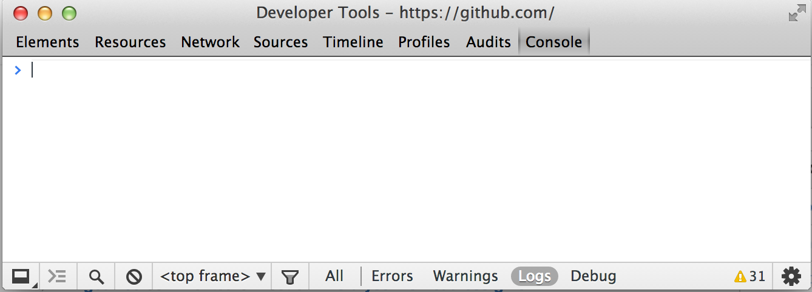
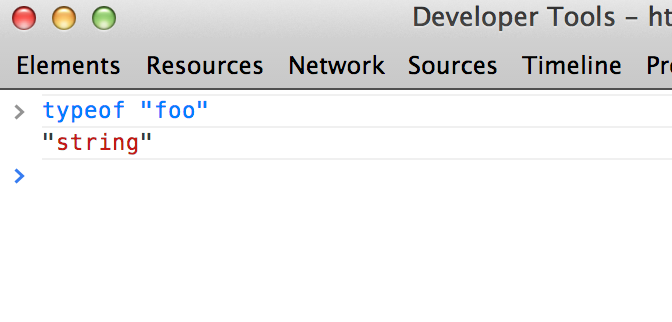
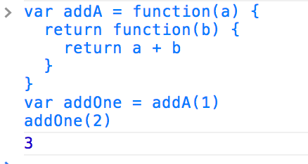

CS558 Technology Lecture 1: JavaScript
=========================================
We are experimenting with the structure of CS558 this semester.  Unlike in previous years, we are going to try out a new format, where students will create original software contributions.  This leads us to adopt an organization which is more like a creative writing course than a traditional rigidly structured programming environment.  To this end you will each be publishing open source modules each week.  As the course progresses you will be able to use both your own modules and the modules that other students have written.  At the half way point in the course, we will switch into a project focused mode where all the modules written so far will be available for you to use in creating something brand new yourself.

## Why use JavaScript and node.js?
The choice of JavaScript may seem somewhat unconventional, but after reviewing the other possibilities there are quite a few strong reasons to choose it:

* Easy to set up, low barrier to entry
* Simple distribution and demonstration, can use in a web page
* Fast performance, comparable to Java in most cases
* Good tools for collaboration and sharing code
* Most widely used programming language in the world

It is also maybe worth saying a bit about the other options that were considered, and the reasons why we ultimately decided not to use them:

* C/C++/Java: Very poor support for modules and dependency management/versioning.  Difficult to collaborate in and share code.
* Ruby: Strong package manager and easy set up, but extremely poor performance.  Not well suited for writing efficient algorithms and data structures.
* Python: Excellent language and strong academic community, many good libraries.  However, set up is very difficult, distribution and dependency management is a total nightmare.  Has multiple incompatible package managers, all are much weaker than npm/gem. (This would be my second choice)
* MATLAB: Good for numerical computing, but the language is insufficiently expressive for writing complex data structures.  
* Multiple languages/agnostic grading:  Difficult to collaborate, too much confusion.

The reason to use node.js is that adds support for modules and lets you run JavaScript programs from the terminal.  This makes testing more convenient and allows for the reuse and sharing of code.

# A quick introduction to JavaScript

## Quick start
I said earlier that JavaScript is the most ubiquitous programming language.  In fact, if you are reading this in a web browser you can start coding in JS right now and follow along with this tutorial.  To do this in Google Chrome just press Control+Shift+J  (or Command+Shift+J on a Mac) to open up Chrome's developer tools.  On Firefox you can do this using Control+Option+K.

Once open, click on the "Console" tab and you will get an interactive command prompt that looks like this:



Here you can type in JavaScript and execute it directly in your browser without even having to download or set anything up.

## Basic JavaScript

JavaScript is a dynamically typed object oriented language. The syntax of JavaScript is a lot like C++, so for example:

```javascript
// This is a comment
/* And so is this */
```
Just like C++ or Java, JavaScript is an imperative language (compared to an expression based language like Lisp or Scheme).  Programs in JavaScript consist of sequences of commands that are executed serially.  However unlike C++, semicolons in JavaScript are optional.  You only need to add them if you want to put multiple statements on the same line.  So this,

```javascript
x = 1
y = 2
```

Is the same as this,

```javascript
x = 1;
y = 2;
```

Which is the same as this,

```javascript
x = 1; y = 2
````

You can also use standard structured programming constructs like for/while loops and if statements, and they work exactly the same as in any other C-like language.  For example,

```javascript
var j = 0
for(var i=0; i<10; ++i) {
  if(i % 2 > 0) {
    j += 1
  } else {
    j += 3
  }
}
```

### Advanced:  The one place where you need a semicolon
There is one place where semicolons are required in JavaScript:  before an expression statement.  Consider the following example:

```javascript
var x = { foo: 1 }

(function() {
  console.log("executing a function immediately!")
})()
```

You might think this code declares a variable x, makes an anonymous function and executes it.  However, instead what will happen is that it will be converted into this code:

```javascript
var x = { foo: 1 }(function() {
  console.log("executing a function immediately!")
})()
```

Which will try to invoke the object `{foo: 1}` as a function.  To avoid this situation, always put a semicolon **before** any expression statement.  Here is a correct example:

```javascript
var x = { foo: 1 }

;(function() {
  console.log("executing a function immediately!")
})()
```

## Types in JavaScript
Coming from a C++/Java background the weirdest thing about JavaScript is its dynamic typing system.  This means that the types of variables are determined at run time.  For example, to declare a variable `a` and initialize it with an integer value of `1` we can write in JavaScript:

```javascript
var a = 1
```

Unlike C++ or Java, we don't need to declare the type of a variable when we define it.  Instead the JavaScript run time tracks the type of `a` as the program executes.  In JavaScript, the type of a variable is always one of the following basic types:

* Numbers: Which are represented as 64-bit double precision floats internally.  Example: `1.0`
* Strings: That are arrays of characters, just like in Java.  Example: `"hello world"`
* Booleans: Logical true/false values.  Example: `true`
* Functions: Executable blocks of code. (more on this below)
* Objects: An unordered collection of name-value pairs (more on this below).
* Undefined: Which is the default type for uninitialized variables

And that's it!  You can figure out the type of a variable using the `typeof` operator.  For example,



Numbers, strings and booleans in JavaScript work basically like how you would expect and they support the same operators as in C++ or Java for the most part.  For example, you can add two numbers using the `+`, subtract them using `-`, use boolean short circuits with `&&` and `||`, and there is even a ternary operator `?`

```javascript
> var a = 1
undefined
> 1 + a
2
> a += 2
3
> 1 - a
-2
> (1 < 2) || (5 > 3)
true
> "foo" === "bar" ? "equal" : "not equal"
"not equal"
```

### Important: The `==` and `===` operators
The only slightly tricky thing about operators in JavaScript is the existence of the extra `===` comparison.  Both `==` and `===` are equality operators, but the main difference is that `===` does not do any type coercion.  For example,

```javascript
> "1" == 1
true
> "1" === 1
false
```

For this reason, it is generally preferred to use the `===` operator unless you explicitly want to do the type coercion.

## Functions
There are two basic ways to declare a function in JavaScript.

Anonymously:
```javascript
var f = function(a, b) { return a + b }
```

Named:
```javascript
function g(a, b) { return a + b }
```

In both cases, we can call the function just like we would in C/Java:

```javascript
> f(1, 2)
3
> g(3, 4)
7
```

However, unlike in C++ or Java, functions in JavaScript have lexical scoping.  This means that we can create functions that return functions.  For example,



JavaScript has a number of useful functions built into the language.  For example, to print some debug information in JavaScript you can use the console.log() function:

```javascript
console.log("test") //Prints test
```

### Callbacks and timers
One important principle in JavaScript is that IO and user interactions are asynchronous.  However, JavaScript itself is a single threaded language and doesn't support concepts like parallel execution.  Instead, JavaScript uses callbacks to achieve parallel execution.  For example, to log a message 5 seconds in the future we can schedule an event using the setTimeout command:

```javascript
setTimeout(function() { console.log("hello") }, 5000)
```

The setTimeout command takes two arguments, a callback and a number reprsenting the number of milliseconds in the future that the event will be triggered.  The way JavaScript executes is that there is an internal event loop that selects the next available callback and runs it.  This is in contrast to languages like C++ or Java which maintain total control of the CPU at all times.  There are a number of advantages to event based concurrency, though we will say more about this in the next lecture on node.js.

## Objects
As would be expected from the type system, objects in JavaScript are very different than in C++ or Java.  Unlike most other languages JavaScript objects are dynamic in the sense that they can have extra names and values added to them at run time.  There are two basic ways to create an object in JavaScript:


Using JSON syntax:
```javascript
var obj = {
  foo: 1,
  bar: "xyz",
  subobject: {
    z: false
  }
}
```

Or using the `new` keyword:
```javascript
function Point(x, y, z) {
  this.x = x
  this.y = y
  this.z = z
}

var p = new Point(1,2,3)
```

We can access the items within an object using either the square brackets `[]` or `.` syntax just like in Java:

```javascript
obj["foo"] = 1
obj.bar = false
```

Assigning to a name in an object creates a new value.  In this way, it is possible to use objects like a hash map.

Just like in Java, all JavaScript objects are passed by reference.  So, the following snippet:

```javascript
var a = { foo: 1 }
var b = a
b.foo = 2
console.log(a.foo)
```

Will print out,

```javascript
2
```

Just like object references in Java and pointers in C, object references in JavaScript are nullable.  To create a null object reference, you can use the keyword `null`:

```javascript
var nullref = null
```

If you try to access the properties of a null object in JavaScript, the run time will thrown an exception just like in Java.

One thing that is unique about JavaScript is that you can iterate over all the names in an object using a for in loop:

```javascript
for(var name in obj) {
  console.log("key:", name, ", value:", obj[name])
}
```

In this way it is very easy to reflect into an object at run time, or to use an object as a container.

One very useful pair of functions in JavaScript are the JSON.stringify and JSON.parse methods.  These pair of functions let you serialize and deserialize JavaScript objects providing that they contain no cyclic references.

### Arrays
Arrays are implemented as a special kind of object in JavaScript.  To declare an array, you use square brackets:

```javascript
var x = [1,2,3,4]
console.log(x[2])
```

Unlike objects, arrays have an extra property called `.length` which gives you the number of items in the array.  For example,

```javascript
> [2,5].length
2
```

You can also mutate the contents of an array using the push, pop, shift and unshift methods.  These tools let you use any array as a stack, queue or deque:

* `shift` removes an item from the front of an array
* `unshift` adds an item to the front of an array
* `pop` removes an item from the end of an array
* `push` appends an item to the end of an array

There is also a more powerful method for mutating arrays called `splice` which allows you to use them like a B-tree.  `splice` lets you insert or delete contiguous subsequences from an array.  For example,

```javascript
var x = [1,2,3,4]
x.splice(2, 1, 5, 6)   //At position 2, remove 1 element and insert the sequence [5,6]
console.log(x)
//Prints:  [1, 2, 5, 6, 4]
```

## Builtins
There are also a number of built in functions that make programming JavaScript easier.  Here is a quick overview:

* `Math` The math object exposes a bunch of basic functions for doing arithmetic.  For example, `Math.sin`, `Math.sqrt`, etc.
* Strings have a number of builtins
* Arrays also have many useful built in functions
* The `Date` class lets you access timing and date specific functions
* There is also built in support for regular expressions, with a perl-like syntax
* Finally, there are Lispy functional programming methods for currying and calling functions.  In particular, .call, .apply and .bind are very useful, along with the array methods .map and .forEach.

## Further topics
The above material pretty much covers all the basics of JavaScript.  The fact that we can cover the whole language in such a short amount of time is really a testament to the simplicity of JavaScript as a language.  However, there are a few things that you ought to study on your own as the semester progresses.

### prototypes
JavaScript does not support a classical inheritance model, but for performance reasons it does allow for the use of object templates or prototypes.  You should read about prototypes on your own to understand how this works and be able to explain when and why you might use a prototype to instantiate an object.

### Exceptions
JavaScript supports exceptions, just like Java.  There is also a built in object type called "Error" which tracks the line number at which it was first constructed.  This is useful for creating stack traces if your program performas an illegal operation at some point.

### Typed arrays
Typed arrays are a relatively new feature in JavaScript, but they offer enormous performance benefits.  Unlike regular arrays which are basically objects, typed arrays are contiguous binary blocks of memory and have an enforced integer/floating point type.  Using typed arrays judiciously can give a large performance benefit in many applications.

### Defined properties
One of the neat syntactic features in JavaScript is that you can replace properties of objects with functions using the Object.defineProperty.


# References
The following references are helpful in learning more about JavaScript and in solving problems as they come up:

* [Effective JavaScript](http://effectivejs.com/):  Good reference for those coming from a C++/Java background covers all the important parts.
* [Eloquent JavaScript](http://eloquentjavascript.net/): A bit slower than effective JavaScript.  Might be better for those with less programming experience.  Also available for free online.
* [Mozilla Developer's Network](https://developer.mozilla.org/en-US/) A collection of community written reference articles maintained by Mozilla.
* [Stack Overflow](http://stackoverflow.com/) A free question & answer site with pretty good moderation.

There is also a sequence of exercises at codeacademy that can help you get a better handle on the basics, though it is a bit more focused on beginners.  If you are looking for some extra practice it might not be bad to give it a shot working through some of the exercises:

* [CodeAcademy JavaScript](http://www.codecademy.com/tracks/javascript)

## Warning
JavaScript is an enormously popular language, and so there is a large industry that has grown up around it.  However, there are some sources which claim to be authoritative on JavaScript but provide misinformation and may confuse beginners.  You should stay clear of the following websites

* W3 Schools: Just avoid this website.  Lots of the content is either wrong or misleading, yet it remains high in the Google search rankings due to the manipulative practices of the website.  For more information see [w3fools.com](http://www.w3fools.com/)
* Experts Exchange: This site requires payments to access most content, and a lot of the headlines.  Thankfully stack overflow has mostly surpassed it in search rankings so you don't see it around as much these days.
